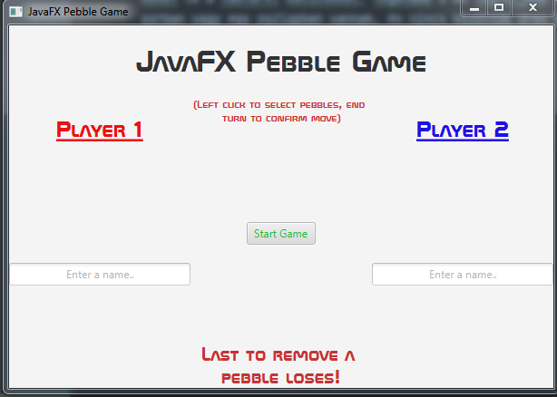
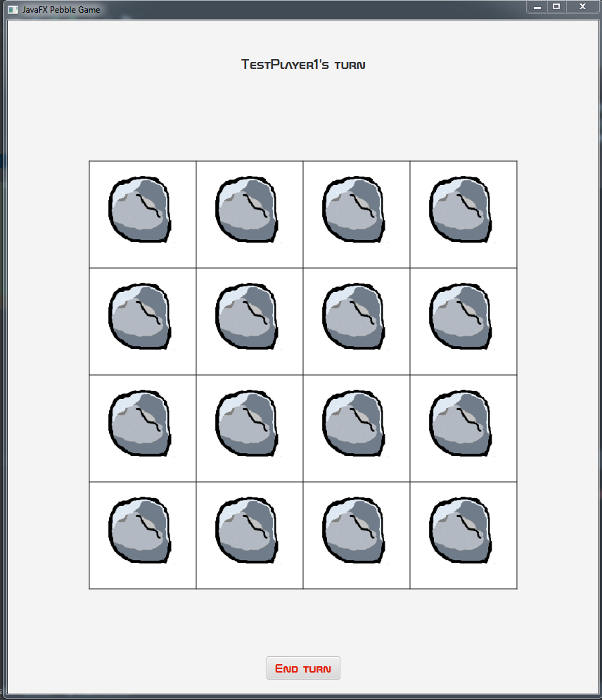
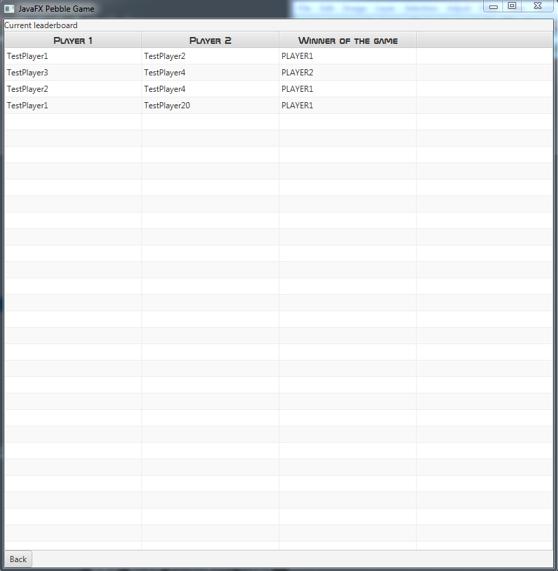

# JavaFX Pebble Game

## Készítette: Gordos Máté

Egy 4 x 4 mezőből álló tábla mezőire 16 darab kavicsot helyezünk, minden mezőre egyet-egyet. A két játékos felváltva vehet le a tábláról kavicsokat, legalább 1 és legfeljebb 4 darabot. Csak olyan kavicsokat lehet levenni, amelyek egy sorban vagy egy oszlopban vannak, és nincs közöttük üres mező. Az veszít, aki utoljára lép.
---
A játék menüje

---
A játékmenet

---
A játék leaderboardja

